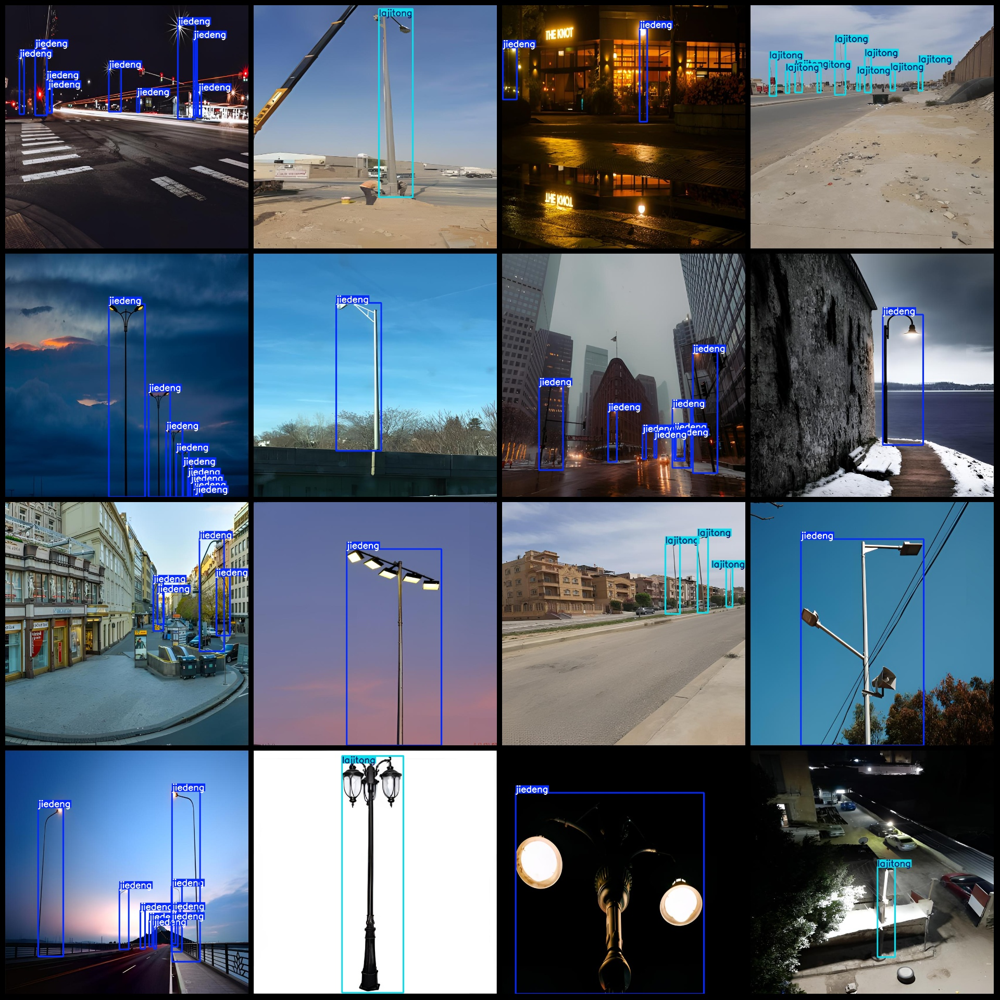

# Smart City Lights and Trash Can Detection Dataset VOC+YOLO Format: 654 Images, 2 Classes

The dataset format is Pascal VOC format + YOLO format (excluding the split path in txt files, only containing jpeg images and corresponding VOC format xml files and yolo format txt files).

Number of images (jpg file counts): 654
Number of annotations (xml file counts): 654
Number of annotations (txt file counts): 654
Number of annotation categories: 2
Annotation category names (note that the order of categories in the yolo format does not correspond to this, but rather to the labels folder's classes.txt): ["jiedeng", "lajitong"]
Each category has a number of bounding box boxes:
"jiedeng" (streetlights) = 1398
"lajitong" (trash cans) = 466
Total bounding boxes = 1864
Each category occupies a certain number of images:
"jiedeng" occupies images = 462
"lajitong" occupies images = 192
Image resolution: 832x832
Annotation tool used: labelImg
Annotation rule: draw rectangular boxes for each class
Important note: The dataset does not have been divided into training, validation, or test sets; you need to do so yourself.
Special declaration: This dataset does not guarantee the accuracy of the trained model or the weight files.
Image preview:
Annotation example:

## Images

Here is a pay link on Stripe ( https://buy.stripe.com/3cs8yP7sY87d0vu9AB ). Please contact me lonlonago@foxmail.com after funding $89, and I will send you a complete data files , thank you!

